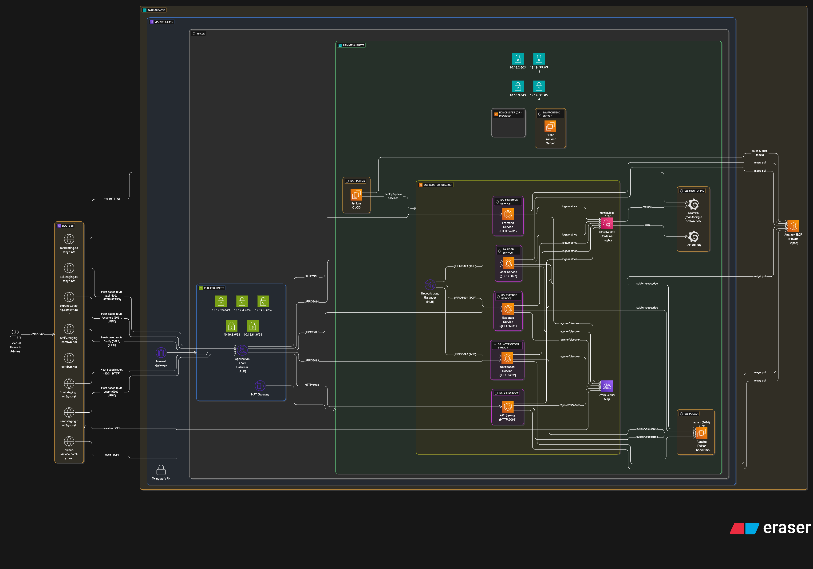

# AWS ECS Microservices Platform - comyno Infrastructure

A comprehensive AWS ECS-based microservices platform built with Terraform that implements a scalable, secure, and highly available architecture for the comyno expense management application.

## 🏗️ Architecture Overview

This infrastructure deploys a production-ready microservices platform with:

- **AWS ECS Fargate**: Serverless container orchestration
- **Multi-Tier Load Balancing**: ALB for HTTP/HTTPS, NLB for gRPC services
- **Service Discovery**: AWS Cloud Map for dynamic service registration
- **Message Broker**: Apache Pulsar for event-driven architecture
- **CI/CD Integration**: Jenkins for automated deployments
- **Monitoring Stack**: CloudWatch, Grafana, and Loki

## 📊 Architecture Diagram



*The diagram above illustrates the complete microservices architecture including VPC networking, ECS clusters, load balancers, service discovery, and supporting infrastructure components.*

## 🌐 Network Architecture

### VPC Configuration
- **CIDR Block**: `10.10.0.0/16`
- **Region**: US-East-1
- **Multi-AZ**: High availability deployment

### Subnet Layout
```
Public Subnets:
├── 10.10.16.0/24 - Load balancers, NAT Gateway
├── 10.10.4.0/24  - Public services
├── 10.10.5.0/24  - Frontend servers
├── 10.10.0.0/24  - Jenkins, monitoring
└── 10.10.64.0/24 - Additional public resources

Private Subnets:
├── 10.10.2.0/24   - ECS services (primary)
├── 10.10.192.0/24 - ECS services (secondary)
├── 10.10.3.0/24   - Database tier
└── 10.10.128.0/24 - Additional private resources
```

## 🚀 Microservices Architecture

### Core Services

#### 1. User Service
- **Port**: 5000 | **Protocol**: gRPC
- **Image**: `sv-user:staging`
- **Endpoint**: `user.staging.comyno.net`

#### 2. Expense Service  
- **Port**: 5001 | **Protocol**: gRPC
- **Image**: `sv-expense:staging`
- **Endpoint**: `expense.staging.comyno.net`

#### 3. Notification Service
- **Port**: 5002 | **Protocol**: gRPC
- **Image**: `sv-notify:staging`
- **Endpoint**: `notify.staging.comyno.net`

#### 4. API Gateway Service
- **Port**: 5003 | **Protocol**: HTTP/REST
- **Image**: `sv-core-api:staging`
- **Endpoint**: `api.staging.comyno.net`

#### 5. Frontend Service
- **Port**: 4201 | **Protocol**: HTTP
- **Image**: `frontend-svc:staging`
- **Endpoint**: `front.staging.comyno.net`

## ⚖️ Load Balancing Strategy

### Application Load Balancer (ALB)
- **Type**: Public-facing
- **Protocol**: HTTP/HTTPS
- **SSL/TLS**: ACM certificate integration
- **Routing**: Host-based routing to microservices

### Network Load Balancer (NLB)
- **Type**: Internal
- **Protocol**: TCP
- **Use Case**: gRPC services communication
- **Performance**: High-throughput, low-latency

## 🔍 Service Discovery

### AWS Cloud Map
- **Namespace**: `servicemap.comyno.net`
- **Registration**: Automatic service registration
- **Health Checks**: Integrated health monitoring

### Route 53 DNS Management
```
Domain Mappings:
├── api.staging.comyno.net     → API Gateway Service
├── user.staging.comyno.net    → User Service
├── expense.staging.comyno.net → Expense Service
├── notify.staging.comyno.net  → Notification Service
├── front.staging.comyno.net   → Frontend Service
├── jenkins.comyno.net         → Jenkins CI/CD
├── monitoring.comyno.net      → Grafana Dashboard
└── pulsar-service.comyno.net  → Pulsar Message Broker
```

## 📦 Container Management

### Amazon ECR
- **Registry**: `462612573069.dkr.ecr.us-east-1.amazonaws.com`
- **Repositories**: Service-specific private repositories
- **Security**: Image vulnerability scanning

### Container Images
```
├── sv-user:staging        → User Service
├── sv-expense:staging     → Expense Service  
├── sv-notify:staging      → Notification Service
├── sv-core-api:staging    → API Gateway
└── frontend-svc:staging   → Frontend Application
```

## 🔧 Supporting Infrastructure

### Message Broker
- **Technology**: Apache Pulsar
- **Service URL**: `pulsar-service.comyno.net:6650`
- **Admin Interface**: Port 8080

### CI/CD Pipeline
- **Jenkins**: `jenkins.comyno.net:8080`
- **Function**: Automated build and deployment

### Monitoring Stack
- **Grafana**: `monitoring.comyno.net:3000`
- **CloudWatch**: Container Insights enabled
- **Logging**: Centralized log aggregation

## 🔐 Security Features

### Network Security
- **Private Subnets**: ECS services isolated from internet
- **Security Groups**: Service-specific access control
- **NAT Gateway**: Controlled outbound internet access

### Access Control
- **IAM Roles**: ECS task-level permissions
- **Twingate VPN**: Secure remote access
- **SSL/TLS**: End-to-end encryption

## 🚀 Quick Start

### Prerequisites
1. **AWS CLI** configured
2. **Terraform** >= 0.12 installed
3. **Docker** for container builds
4. **AWS Account** with ECS permissions

### Deployment Steps

```bash
# 1. Initialize Terraform
terraform init

# 2. Plan deployment
terraform plan

# 3. Apply configuration
terraform apply

# 4. Build and push container images
aws ecr get-login-password --region us-east-1 | docker login --username AWS --password-stdin 462612573069.dkr.ecr.us-east-1.amazonaws.com
```

## 📁 Project Structure

```
aws-ecs-project/
├── main.tf                    # Main infrastructure
├── variables.tf               # Variable definitions
├── providers.tf               # Provider configurations
└── modules/
    ├── vpc/                  # VPC and networking
    ├── ecs/                  # ECS clusters and services
    ├── ec2/                  # EC2 instances
    ├── ecr/                  # Container registry
    ├── dns/                  # Route 53 DNS
    ├── acm/                  # SSL certificates
    ├── security_group/       # Security groups
    └── twingate/             # VPN access
```

## 🔄 Service Communication

### Communication Patterns
1. **API Gateway Pattern**: ALB routes to API service
2. **Service Mesh**: Internal gRPC communication
3. **Event-Driven**: Pulsar message broker
4. **Load Balancing**: Multiple LB types

### Service Dependencies
```
Frontend Service
    ↓ (HTTP)
API Gateway Service
    ↓ (gRPC)
┌─────────────────────────────┐
│ User Service                │
│ Expense Service             │ ← Pulsar Messages
│ Notification Service        │
└─────────────────────────────┘
```

## 📊 Monitoring

### Health Checks
```
├── User Service      → /user.UserService/Check
├── Expense Service   → /expense.ExpenseService/Check
├── Notify Service    → /notify.NotifyService/Check
├── API Service       → /health
└── Frontend Service  → /health
```

### CloudWatch Integration
- **Container Insights**: ECS metrics
- **Application Logs**: Centralized logging
- **Custom Metrics**: Business monitoring
- **Alarms**: Automated alerting

## 🚨 Troubleshooting

### Useful Commands
```bash
# Check ECS service status
aws ecs describe-services --cluster staging-cluster --services user-service-staging

# View service logs
aws logs get-log-events --log-group-name /ecs/user-service-staging

# Check load balancer health
aws elbv2 describe-target-health --target-group-arn <target-group-arn>
```

## 🔄 CI/CD Integration

### GitHub Actions Setup

This project includes comprehensive GitHub Actions integration with AWS IAM roles for secure deployments.

#### IAM Role Configuration
- **GitHub Actions User**: Dedicated IAM user for CI/CD operations
- **Deployment Role**: Cross-account role assumption for secure deployments
- **Secrets Manager**: Secure storage of GitHub Actions credentials
- **Permissions**: Granular permissions for ECS, ECR, Route53, and other AWS services

#### Required GitHub Secrets
```bash
# AWS Credentials (stored in AWS Secrets Manager)
AWS_ACCESS_KEY_ID          # GitHub Actions user access key
AWS_SECRET_ACCESS_KEY      # GitHub Actions user secret key
AWS_REGION                 # us-east-1
AWS_ACCOUNT_ID            # Your AWS account ID

# Application Secrets
TWINGATE_API_KEY          # VPN access configuration
ECR_REGISTRY              # 462612573069.dkr.ecr.us-east-1.amazonaws.com
```

#### Deployment Workflow Structure
```yaml
# Recommended .github/workflows/deploy.yml structure
name: Deploy to AWS ECS

on:
  push:
    branches: [main, staging]
  pull_request:
    branches: [main]

jobs:
  build-and-deploy:
    runs-on: ubuntu-latest
    steps:
      - name: Checkout code
      - name: Configure AWS credentials
      - name: Login to Amazon ECR
      - name: Build and push Docker images
      - name: Deploy to ECS
      - name: Update Route53 records
      - name: Run health checks
```

### Multi-Service Deployment Pipeline

#### 1. **Build Stage**
```bash
# Build all microservices
docker build -t sv-user:${{ github.sha }} ./user-service
docker build -t sv-expense:${{ github.sha }} ./expense-service
docker build -t sv-notify:${{ github.sha }} ./notification-service
docker build -t sv-core-api:${{ github.sha }} ./api-service
docker build -t frontend-svc:${{ github.sha }} ./frontend-service
```

#### 2. **Push to ECR**
```bash
# Tag and push to ECR
docker tag sv-user:${{ github.sha }} $ECR_REGISTRY/sv-user:${{ github.sha }}
docker push $ECR_REGISTRY/sv-user:${{ github.sha }}
# Repeat for all services...
```

#### 3. **ECS Service Updates**
```bash
# Update ECS service definitions
aws ecs update-service \
  --cluster staging-cluster \
  --service user-service-staging \
  --task-definition user-service:${{ github.sha }}
```

#### 4. **Health Check Validation**
```bash
# Validate service health
curl -f https://user.staging.comyno.net/user.UserService/Check
curl -f https://api.staging.comyno.net/health
```

### Environment-Specific Deployments

#### Staging Environment
- **Trigger**: Push to `staging` branch
- **Target**: `staging-cluster`
- **Services**: All microservices with staging configuration
- **Domain**: `*.staging.comyno.net`

#### Production Environment
- **Trigger**: Push to `main` branch (with manual approval)
- **Target**: `production-cluster`
- **Services**: Production-ready services
- **Domain**: `*.comyno.net`

### Rollback Strategy
```bash
# Quick rollback to previous version
aws ecs update-service \
  --cluster staging-cluster \
  --service user-service-staging \
  --task-definition user-service:previous-sha
```

### Jenkins Integration (Alternative)

For teams preferring Jenkins over GitHub Actions:

#### Jenkins Pipeline Configuration
- **Jenkins Server**: `jenkins.comyno.net:8080`
- **Pipeline**: Multibranch pipeline with Jenkinsfile
- **Integration**: ECR, ECS, and Route53 updates
- **Notifications**: Slack/email integration for deployment status

#### Jenkinsfile Structure
```groovy
pipeline {
    agent any
    stages {
        stage('Build') {
            steps {
                script {
                    // Build Docker images
                    sh 'docker build -t sv-user:${BUILD_NUMBER} ./user-service'
                }
            }
        }
        stage('Push to ECR') {
            steps {
                script {
                    // Push to ECR
                    sh 'aws ecr get-login-password | docker login --username AWS --password-stdin $ECR_REGISTRY'
                    sh 'docker push $ECR_REGISTRY/sv-user:${BUILD_NUMBER}'
                }
            }
        }
        stage('Deploy to ECS') {
            steps {
                script {
                    // Update ECS services
                    sh 'aws ecs update-service --cluster staging-cluster --service user-service-staging'
                }
            }
        }
    }
}
```

### Monitoring and Observability in CI/CD

#### ELK Stack Integration
The project includes a comprehensive ELK (Elasticsearch, Logstash, Kibana) stack for log aggregation:

```yaml
# ELK Stack Components (docker-compose.yml)
services:
  elasticsearch:  # Log storage and indexing
  logstash:      # Log processing and transformation
  kibana:        # Log visualization and dashboards
  metricbeat:    # System and application metrics
  filebeat:      # Log shipping from containers
  apm-server:    # Application performance monitoring
```

#### Deployment Monitoring
- **CloudWatch**: ECS service deployment metrics
- **Grafana**: Real-time deployment dashboards
- **Kibana**: Log analysis during deployments
- **Health Checks**: Automated service validation

### Security in CI/CD

#### IAM Permissions (Least Privilege)
```json
{
  "Version": "2012-10-17",
  "Statement": [
    {
      "Effect": "Allow",
      "Action": [
        "ecs:*",
        "ecr:*",
        "route53:*",
        "elasticloadbalancing:*",
        "logs:*",
        "cloudwatch:*"
      ],
      "Resource": "*"
    },
    {
      "Effect": "Deny",
      "Action": [
        "billing:*",
        "account:*",
        "ec2:*ReservedInstances*"
      ],
      "Resource": "*"
    }
  ]
}
```

#### Secrets Management
- **AWS Secrets Manager**: Secure credential storage
- **GitHub Secrets**: Encrypted environment variables
- **Rotation**: Automated credential rotation
- **Audit**: CloudTrail logging for all CI/CD activities

### Deployment Flow Summary
```
┌─────────────┐    ┌──────────────┐    ┌─────────────┐    ┌──────────────┐
│ Code Commit │ -> │ GitHub       │ -> │ Build &     │ -> │ ECR Push     │
│             │    │ Actions      │    │ Test        │    │              │
└─────────────┘    └──────────────┘    └─────────────┘    └──────────────┘
                                                                   │
┌─────────────┐    ┌──────────────┐    ┌─────────────┐    ┌──────────────┐
│ Health      │ <- │ DNS Update   │ <- │ ECS Deploy  │ <- │ Task         │
│ Check       │    │ (Route53)    │    │             │    │ Definition   │
└─────────────┘    └──────────────┘    └─────────────┘    └──────────────┘
```

## 📝 Contributing

1. Fork the repository
2. Create a feature branch
3. Test in staging environment
4. Submit a pull request

## 📄 License

MIT License - see LICENSE file for details.

## 🤝 Support

- Create an issue in this repository
- Review troubleshooting section
- Check AWS documentation
